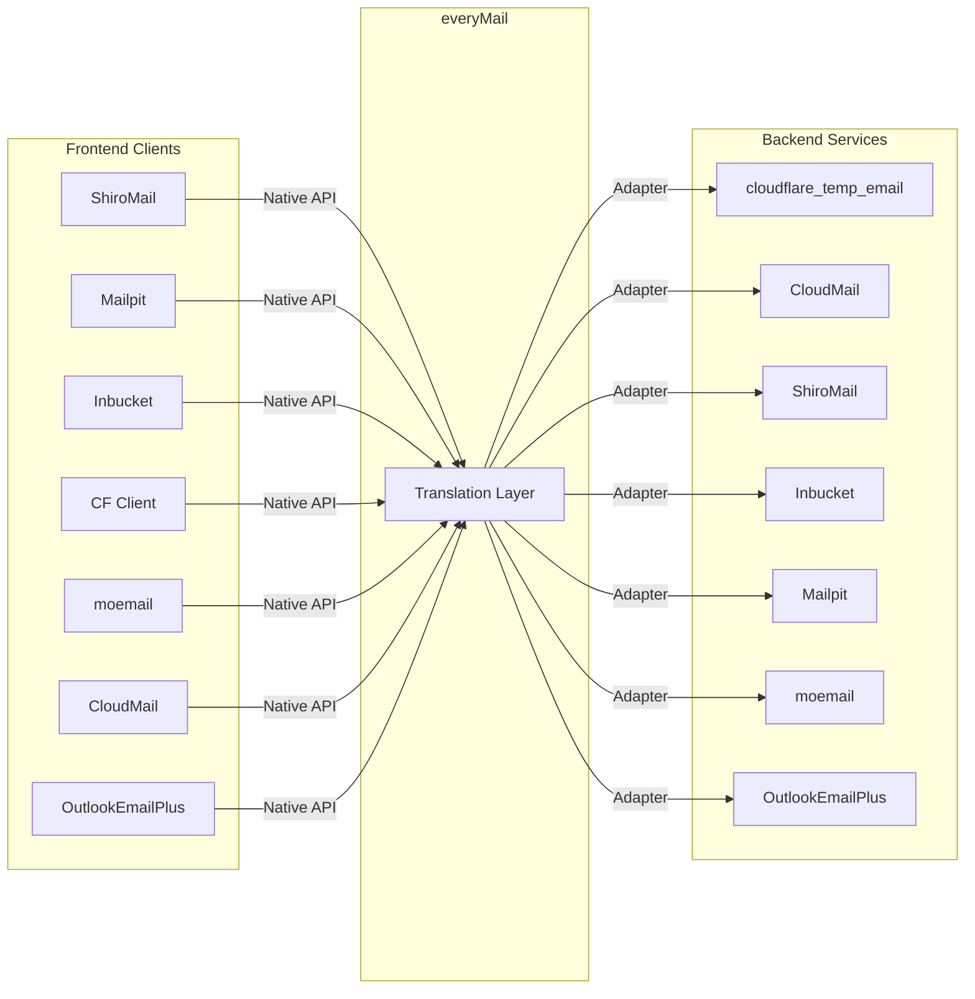
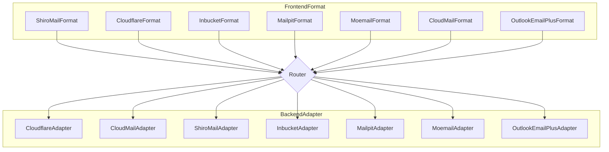
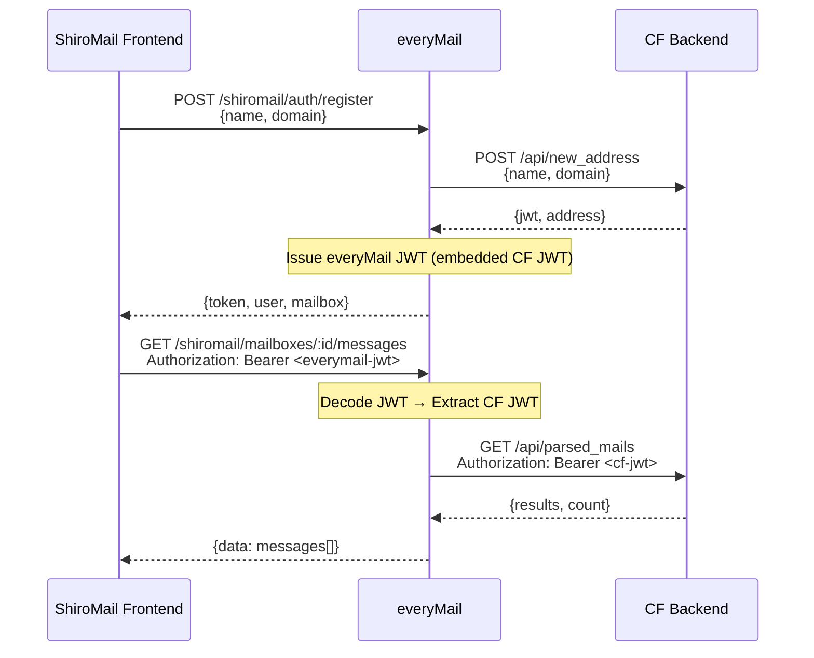

[中文](./README.md) | English

# everyMail

[](./LICENSE)
[](https://ghcr.io/wangchudi/everymail)
[](https://nodejs.org)

Temporary email API compatibility layer — connect any frontend client to any backend email service.



## Table of Contents

- [Features](#features)
- [Compatibility Matrix](#compatibility-matrix)
- [Quick Start](#quick-start)
- [Docker Deployment](#docker-deployment)
- [Environment Variables](#environment-variables)
- [API Routes](#api-routes)
- [Backend Mapping Notes](#backend-mapping-notes)
- [Architecture](#architecture)
- [Acknowledgments](#-acknowledgments)

## Features

- **N×M Matrix** — 7 frontend formats × 7 backends, any combination
- **Zero-modification access** — Frontend clients connect directly without changes
- **One-switch backend migration** — Change `MAIL_BACKEND` to switch
- **Docker one-liner** — Pre-built multi-arch images (amd64/arm64)
- **Extensible** — Implement one interface to add a new frontend or backend

## Compatibility Matrix

### Backends (`MAIL_BACKEND`)

| Value | Project | Notes |
|---|---|---|
| `cloudflare_temp_email` | [cloudflare_temp_email](https://github.com/dreamhunter2333/cloudflare_temp_email) | Default, temporary email model |
| `cloudmail` | [cloud-mail](https://github.com/maillab/cloud-mail) | Full account/mailbox system |
| `shiromail` | [ShiroMail](https://github.com/GALIAIS/ShiroMail) | Reverse proxy mode |
| `inbucket` | [Inbucket](https://github.com/inbucket/inbucket) | SMTP testing tool, no auth required |
| `mailpit` | [Mailpit](https://github.com/axllent/mailpit) | Global inbox mode |
| `moemail` | [moemail](https://github.com/beilunyang/moemail) | Cloudflare Pages + D1 |
| `outlookemailplus` | [OutlookEmailPlus](https://github.com/ZeroPointSix/outlookEmailPlus) | Controlled External API + mail pool |

### Frontend Formats (`ENABLED_FRONTENDS`)

| Value | Route Prefix | Notes |
|---|---|---|
| `shiromail` | `/shiromail` | Native ShiroMail API |
| `cloudflare` | `/cftempmail` | Native cloudflare_temp_email API |
| `inbucket` | `/inbucket` | Inbucket REST API v1 |
| `mailpit` | `/mailpit` | Mailpit REST API v1 |
| `moemail` | `/moemail` | moemail REST API |
| `cloudmail` | `/cloudmail` | CloudMail REST API |
| `outlookemailplus` | `/outlookemailplus` | OutlookEmailPlus External API |

> Any frontend × any backend can be combined. Example: Mailpit UI → moemail backend.

## Quick Start

```bash
git clone https://github.com/WangChuDi/everyMail.git
cd everyMail
npm install
cp .env.example .env   # Edit .env with your backend config
npm run dev            # Development mode (hot reload)
```

Production mode:

```bash
npm run build && npm start
```

Server listens on `http://localhost:3100`.

## Docker Deployment

```bash
docker run -d \
  --name everymail \
  -p 3100:3100 \
  --env-file .env \
  ghcr.io/wangchudi/everymail:latest
```

docker-compose:

```yaml
services:
  everymail:
    image: ghcr.io/wangchudi/everymail:latest
    ports:
      - "3100:3100"
    env_file: .env
    restart: unless-stopped
```

Build locally:

```bash
docker build -t everymail .
docker run -d --name everymail -p 3100:3100 --env-file .env everymail
```

## Environment Variables

### Common

| Variable | Required | Default | Notes |
|---|---|---|---|
| `HOST` | No | `0.0.0.0` | Listen address |
| `PORT` | No | `3100` | Listen port |
| `MAIL_BACKEND` | Yes | — | Backend type (see matrix) |
| `ENABLED_FRONTENDS` | No | `shiromail,cloudflare` | Comma-separated or `all` |
| `JWT_SECRET` | Yes | — | JWT signing secret |
| `LOG_LEVEL` | No | `info` | Log level: debug / info / warn / error |
| `CORS_ORIGIN` | No | `*` | Allowed CORS origin |

### ShiroMail Frontend Format Config

Configuration used when clients connect to the `/shiromail` route:

| Variable | Required | Default | Notes |
|---|---|---|---|
| `SHIROMAIL_API_KEY` | No | — | Client auth API Key, empty = public mode |
| `DOMAIN_MAP` | No | `{}` | Domain ID → domain mapping (JSON), e.g. `{"1":"example.com"}` |
| `DEFAULT_DOMAIN` | No | — | Default domain, empty = auto-detect from backend |

### Backend-Specific

<details>
<summary><b>cloudflare_temp_email</b></summary>

| Variable | Required | Notes |
|---|---|---|
| `CF_TEMP_EMAIL_BASE_URL` | Yes | Worker URL |
| `CF_TEMP_EMAIL_AUTH` | No | Corresponds to CF-side PASSWORDS |

</details>

<details>
<summary><b>cloudmail</b></summary>

| Variable | Required | Notes |
|---|---|---|
| `CLOUDMAIL_BASE_URL` | Yes | CloudMail service URL |
| `CLOUDMAIL_AUTH` | Yes | Authorization token (no Bearer prefix) |
| `CLOUDMAIL_FRONTEND_AUTH` | No | Independent auth for CloudMail frontend format, defaults to `CLOUDMAIL_AUTH` |

> Target project: [maillab/cloud-mail](https://github.com/maillab/cloud-mail), API docs: https://doc.skymail.ink/api/api-doc.html

</details>

<details>
<summary><b>shiromail</b></summary>

| Variable | Required | Notes |
|---|---|---|
| `SHIROMAIL_BACKEND_URL` | Yes | ShiroMail backend URL |
| `SHIROMAIL_BACKEND_API_KEY` | Yes | API Key |

</details>

<details>
<summary><b>inbucket</b></summary>

| Variable | Required | Notes |
|---|---|---|
| `INBUCKET_BASE_URL` | Yes | Inbucket URL (default port 9000) |

</details>

<details>
<summary><b>mailpit</b></summary>

| Variable | Required | Notes |
|---|---|---|
| `MAILPIT_BASE_URL` | Yes | Mailpit URL (default port 8025) |
| `MAILPIT_AUTH` | No | HTTP Basic Auth (`user:pass`) |

</details>

<details>
<summary><b>moemail</b></summary>

| Variable | Required | Notes |
|---|---|---|
| `MOEMAIL_BASE_URL` | Yes | moemail service URL |
| `MOEMAIL_AUTH` | Yes | X-API-Key |

</details>

<details>
<summary><b>OutlookEmailPlus</b></summary>

| Variable | Required | Notes |
|---|---|---|
| `OUTLOOKEMAILPLUS_BASE_URL` | Yes | OutlookEmailPlus service URL |
| `OUTLOOKEMAILPLUS_AUTH` | Yes | External API Key (`X-API-Key`) |
| `OUTLOOKEMAILPLUS_PROVIDER` | No | Mail-pool provider, default `outlook` |
| `OUTLOOKEMAILPLUS_CALLER_ID` | No | Mail-pool caller_id, default `everymail` |
| `OUTLOOKEMAILPLUS_PROJECT_KEY` | No | Mail-pool project_key for project isolation/reuse |
| `OUTLOOKEMAILPLUS_FRONTEND_AUTH` | No | Auth key for the OutlookEmailPlus frontend format, defaults to `OUTLOOKEMAILPLUS_AUTH` |

> Target project: [ZeroPointSix/outlookEmailPlus](https://github.com/ZeroPointSix/outlookEmailPlus), using the controlled `/api/external/*` API.

</details>

## API Routes

Each frontend format exposes the native API of its corresponding project. All requests route to the configured `MAIL_BACKEND`.

<details>
<summary><b>ShiroMail (/shiromail)</b></summary>

| Route | Method | Notes |
|---|---|---|
| `/shiromail/auth/register` | POST | Register/create mailbox |
| `/shiromail/auth/login` | POST | Login |
| `/shiromail/mailboxes` | GET | Mailbox list |
| `/shiromail/mailboxes/:id/messages` | GET | Message list |
| `/shiromail/messages/:id` | GET | Message detail |
| `/shiromail/public/settings` | GET | Public settings |

</details>

<details>
<summary><b>Cloudflare (/cftempmail)</b></summary>

| Route | Method | Notes |
|---|---|---|
| `/cftempmail/open_api/settings` | GET | Public settings |
| `/cftempmail/api/new_address` | POST | Create address |
| `/cftempmail/api/address_login` | POST | Address login |
| `/cftempmail/api/mails` | GET | Message list |
| `/cftempmail/api/parsed_mails` | GET | Parsed message list |
| `/cftempmail/api/mail/:id` | GET | Raw message |

</details>

<details>
<summary><b>Inbucket (/inbucket)</b></summary>

| Route | Method | Notes |
|---|---|---|
| `/inbucket/v1/mailbox/:name` | GET | Mailbox message list |
| `/inbucket/v1/mailbox/:name/:id` | GET | Message detail |
| `/inbucket/v1/mailbox/:name/:id` | DELETE | Delete message |
| `/inbucket/v1/mailbox/:name` | DELETE | Purge mailbox |

</details>

<details>
<summary><b>Mailpit (/mailpit)</b></summary>

| Route | Method | Notes |
|---|---|---|
| `/mailpit/v1/messages` | GET | Message list |
| `/mailpit/v1/message/:id` | GET | Message detail |
| `/mailpit/v1/messages` | DELETE | Delete messages |
| `/mailpit/v1/search` | GET | Search messages |

</details>

<details>
<summary><b>moemail (/moemail)</b></summary>

| Route | Method | Notes |
|---|---|---|
| `/moemail/api/emails/generate` | POST | Create mailbox |
| `/moemail/api/emails/:emailId` | GET | Message list |
| `/moemail/api/emails/:emailId/:messageId` | GET | Message detail |
| `/moemail/api/emails/:emailId` | DELETE | Delete mailbox |

</details>

<details>
<summary><b>CloudMail (/cloudmail)</b></summary>

| Route | Method | Notes |
|---|---|---|
| `/cloudmail/account/add` | POST | Create account |
| `/cloudmail/account/list` | GET | Account list |
| `/cloudmail/email/list` | GET | Message list |
| `/cloudmail/email/delete` | DELETE | Delete message |

</details>

<details>
<summary><b>OutlookEmailPlus (/outlookemailplus)</b></summary>

| Route | Method | Notes |
|---|---|---|
| `/outlookemailplus/api/external/health` | GET | Health check |
| `/outlookemailplus/api/external/pool/claim-random` | POST | Claim/create mailbox |
| `/outlookemailplus/api/external/pool/claim-release` | POST | Release mailbox |
| `/outlookemailplus/api/external/pool/claim-complete` | POST | Mark task complete (compatible no-op) |
| `/outlookemailplus/api/external/messages` | GET | Message list |
| `/outlookemailplus/api/external/messages/:id` | GET | Message detail |
| `/outlookemailplus/api/external/messages/:id/raw` | GET | Raw message detail |

</details>

## Backend Mapping Notes

Each backend has a different API model. everyMail unifies them through the `BackendAdapter` interface.

<details>
<summary><b>CloudMail Mapping</b></summary>

CloudMail is a full email system; the mapping is not one-to-one:

| everyMail Semantic | CloudMail API | Notes |
|---|---|---|
| Create mailbox | `POST /account/add` | Creates account/address |
| Login | Local JWT wrapper | No CF-style login |
| Settings | Derived from `GET /account/list` | Compatible fields |
| Delete mailbox | `DELETE /account/delete` | Release account |
| Message list | `GET /email/list` | Converted to compatible format |
| Message detail | Lookup in `GET /email/list` | List includes details |
| Delete message | `DELETE /email/delete` | Soft delete |
| Purge inbox | Batch `DELETE /email/delete` | Delete one by one |

</details>

<details>
<summary><b>ShiroMail Mapping</b></summary>

Reverse proxy mode, forwards to real ShiroMail backend:

| everyMail Semantic | ShiroMail API | Notes |
|---|---|---|
| Create mailbox | `POST /api/v1/mailboxes` | Returns mailboxId |
| Login | Lookup via `GET /api/v1/mailboxes` | Find by address |
| Delete mailbox | `POST /api/v1/mailboxes/:id/release` | Release |
| Message list | `GET /api/v1/mailboxes/:id/messages` | — |
| Message detail | `GET /api/v1/mailboxes/:id/messages/:msgId` | — |
| Delete message | Not supported | No such API |

</details>

<details>
<summary><b>Inbucket Mapping</b></summary>

Unauthenticated SMTP testing tool, implicit mailbox creation:

| everyMail Semantic | Inbucket API | Notes |
|---|---|---|
| Create mailbox | Locally composed | No create API |
| Message list | `GET /api/v1/mailbox/{name}` | — |
| Message detail | `GET /api/v1/mailbox/{name}/{id}` | — |
| Delete message | `DELETE /api/v1/mailbox/{name}/{id}` | — |
| Purge mailbox | `DELETE /api/v1/mailbox/{name}` | — |

</details>

<details>
<summary><b>Mailpit Mapping</b></summary>

Global inbox mode, filters by address via search:

| everyMail Semantic | Mailpit API | Notes |
|---|---|---|
| Create mailbox | Locally composed | No mailbox concept |
| Message list | `GET /api/v1/search?query=to:{address}` | Filter by address |
| Message detail | `GET /api/v1/message/{id}` | — |
| Delete message | `DELETE /api/v1/messages` + body | — |
| Purge inbox | `DELETE /api/v1/search?query=to:{address}` | — |

</details>

<details>
<summary><b>moemail Mapping</b></summary>

Cloudflare Pages + D1, X-API-Key auth:

| everyMail Semantic | moemail API | Notes |
|---|---|---|
| Create mailbox | `POST /api/emails/generate` | Returns emailId |
| Message list | `GET /api/emails/{emailId}` | Pagination supported |
| Message detail | `GET /api/emails/{emailId}/{messageId}` | — |
| Delete message | `DELETE /api/emails/{emailId}/{messageId}` | — |
| Delete mailbox | `DELETE /api/emails/{emailId}` | Includes all messages |

</details>

<details>
<summary><b>OutlookEmailPlus Mapping</b></summary>

Uses the controlled External API for mail reading; mailbox creation maps to mail-pool claiming:

| everyMail Semantic | OutlookEmailPlus API | Notes |
|---|---|---|
| Create mailbox | `POST /api/external/pool/claim-random` | Returns email and claim_token |
| Login | Local state wrapper | Read APIs are called by email |
| Message list | `GET /api/external/messages` | Uses `email`, `skip`, `top` |
| Message detail | `GET /api/external/messages/:id` | Uses the `email` query parameter |
| Delete message | Not supported | Returns success for compatibility |
| Delete mailbox | `POST /api/external/pool/claim-release` | Only releases mailboxes claimed by this adapter |

</details>

## Architecture



- **Add a new frontend format**: implement the `FrontendFormat` interface, one file
- **Add a new backend**: implement the `BackendAdapter` interface, one file

<details>
<summary><b>Project Structure</b></summary>

```
src/
├── index.ts              # Entry point, registry loop mounting
├── config.ts             # Configuration management
├── types/                # API type definitions
├── adapters/             # Backend adapters (7)
│   ├── base.ts           # BackendAdapter interface
│   ├── cloudflare.ts
│   ├── cloudmail.ts
│   ├── shiromail.ts
│   ├── inbucket.ts
│   ├── mailpit.ts
│   ├── moemail.ts
│   └── outlookemailplus.ts
├── frontend/             # Frontend formats (7)
│   ├── types.ts          # FrontendFormat interface
│   ├── index.ts          # Format registry
│   ├── shiromail.ts
│   ├── cloudflare.ts
│   ├── inbucket.ts
│   ├── mailpit.ts
│   ├── moemail.ts
│   ├── cloudmail.ts
│   └── outlookemailplus.ts
├── middleware/           # Auth, logging, error handling
└── utils/               # JWT, data transformation
```

</details>

<details>
<summary><b>Authentication Flow</b></summary>



</details>

## 🙏 Acknowledgments

This project has been published on the [LINUX DO community](https://linux.do). Thanks to the community for their support and feedback.

## License

MIT
