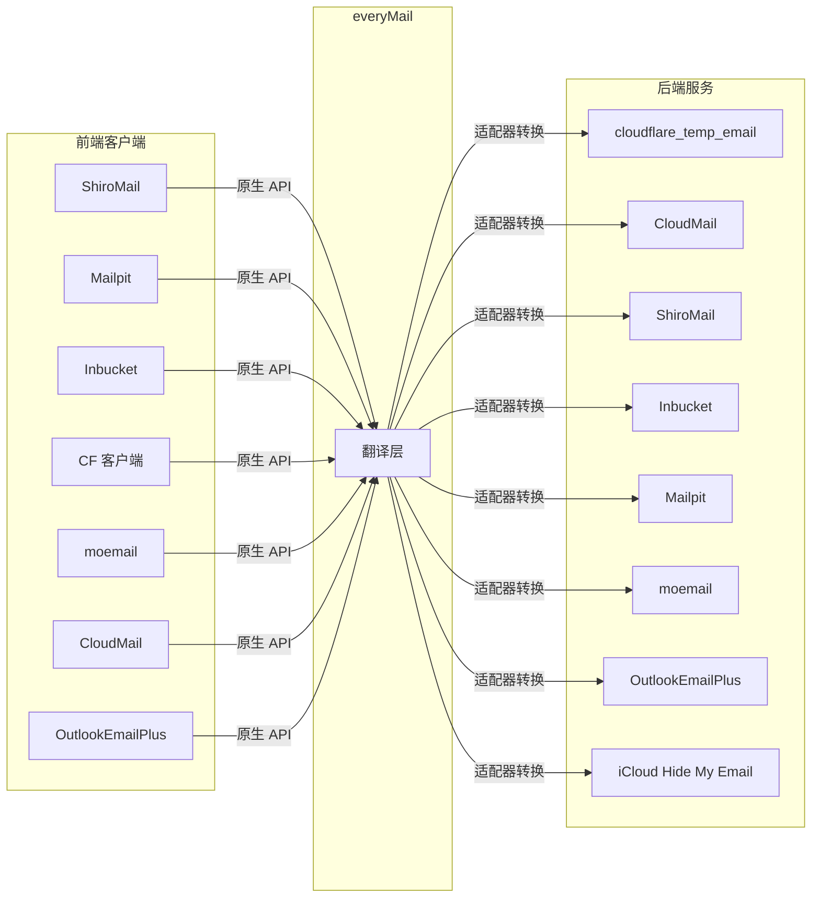
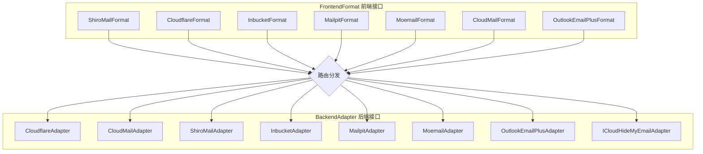
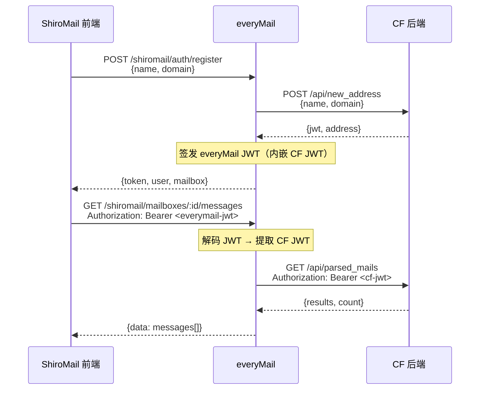

[English](./README.en.md) | 中文

# everyMail

[](./LICENSE)
[](https://ghcr.io/wangchudi/everymail)
[](https://nodejs.org)

临时邮箱 API 兼容层 —— 让任意前端客户端对接任意后端邮箱服务。



## 目录

- [特性](#特性)
- [兼容矩阵](#兼容矩阵)
- [快速开始](#快速开始)
- [Docker 部署](#docker-部署)
- [环境变量](#环境变量)
- [API 路由](#api-路由)
- [后端映射说明](#后端映射说明)
- [架构设计](#架构设计)
- [致谢](#-致谢)

## 特性

- **N×M 矩阵** — 7 种前端格式 × 8 种后端，任意组合
- **零改造接入** — 前端客户端无需修改，直接对接 everyMail
- **一键切换后端** — 修改 `MAIL_BACKEND` 即可迁移
- **Docker 一行启动** — 预构建多架构镜像（amd64/arm64）
- **可扩展** — 实现一个接口即可添加新前端或新后端

## 兼容矩阵

### 后端（`MAIL_BACKEND`）

| 值 | 项目 | 说明 |
|---|---|---|
| `cloudflare_temp_email` | [cloudflare_temp_email](https://github.com/dreamhunter2333/cloudflare_temp_email) | 默认，临时邮箱模型 |
| `cloudmail` | [cloud-mail](https://github.com/maillab/cloud-mail) | 完整账号/邮箱系统 |
| `shiromail` | [ShiroMail](https://github.com/GALIAIS/ShiroMail) | 反向代理模式 |
| `inbucket` | [Inbucket](https://github.com/inbucket/inbucket) | SMTP 测试工具，无需认证 |
| `mailpit` | [Mailpit](https://github.com/axllent/mailpit) | 全局收件箱模式 |
| `moemail` | [moemail](https://github.com/beilunyang/moemail) | Cloudflare Pages + D1 |
| `outlookemailplus` | [OutlookEmailPlus](https://github.com/ZeroPointSix/outlookEmailPlus) | 受控 External API + 邮箱池 |
| `icloud_hide_my_email` | [Hide My Email Generator](https://github.com/rtunazzz/hidemyemail-generator) | iCloud 转发别名，仅创建/保留设置 |

### 前端格式（`ENABLED_FRONTENDS`）

| 值 | 路由前缀 | 说明 |
|---|---|---|
| `shiromail` | `/shiromail` | ShiroMail 原生 API |
| `cloudflare` | `/cftempmail` | cloudflare_temp_email 原生 API |
| `inbucket` | `/inbucket` | Inbucket REST API v1 |
| `mailpit` | `/mailpit` | Mailpit REST API v1 |
| `moemail` | `/moemail` | moemail REST API |
| `cloudmail` | `/cloudmail` | CloudMail REST API |
| `outlookemailplus` | `/outlookemailplus` | OutlookEmailPlus External API |

> 任意前端 × 任意后端均可组合。例如：Mailpit UI → moemail 后端。

## 快速开始

```bash
git clone https://github.com/WangChuDi/everyMail.git
cd everyMail
npm install
cp .env.example .env   # 编辑 .env 填入你的后端配置
npm run dev            # 开发模式（热重载）
```

生产模式：

```bash
npm run build && npm start
```

启动后访问 `http://localhost:3100`。

## Docker 部署

```bash
docker run -d \
  --name everymail \
  -p 3100:3100 \
  --env-file .env \
  ghcr.io/wangchudi/everymail:latest
```

docker-compose：

```yaml
services:
  everymail:
    image: ghcr.io/wangchudi/everymail:latest
    ports:
      - "3100:3100"
    env_file: .env
    restart: unless-stopped
```

本地构建：

```bash
docker build -t everymail .
docker run -d --name everymail -p 3100:3100 --env-file .env everymail
```

## 环境变量

### 通用配置

| 变量 | 必填 | 默认值 | 说明 |
|---|---|---|---|
| `HOST` | 否 | `0.0.0.0` | 监听地址 |
| `PORT` | 否 | `3100` | 监听端口 |
| `MAIL_BACKEND` | 是 | — | 后端类型（见兼容矩阵） |
| `ENABLED_FRONTENDS` | 否 | `shiromail,cloudflare` | 启用的前端格式，逗号分隔或 `all` |
| `JWT_SECRET` | 是 | — | JWT 签名密钥 |
| `LOG_LEVEL` | 否 | `info` | 日志级别：debug / info / warn / error |
| `CORS_ORIGIN` | 否 | `*` | CORS 允许的来源 |

### ShiroMail 前端格式配置

客户端连接 `/shiromail` 路由时使用的配置：

| 变量 | 必填 | 默认值 | 说明 |
|---|---|---|---|
| `SHIROMAIL_API_KEY` | 否 | — | 客户端认证 API Key，留空为公开模式 |
| `DOMAIN_MAP` | 否 | `{}` | Domain ID → 域名映射（JSON），如 `{"1":"example.com"}` |
| `DEFAULT_DOMAIN` | 否 | — | 默认域名，留空则从后端自动获取 |

### 后端专属配置

<details>
<summary><b>cloudflare_temp_email</b></summary>

| 变量 | 必填 | 说明 |
|---|---|---|
| `CF_TEMP_EMAIL_BASE_URL` | 是 | Worker 地址 |
| `CF_TEMP_EMAIL_AUTH` | 否 | 对应 CF 端 PASSWORDS |

</details>

<details>
<summary><b>cloudmail</b></summary>

| 变量 | 必填 | 说明 |
|---|---|---|
| `CLOUDMAIL_BASE_URL` | 是 | CloudMail 服务地址 |
| `CLOUDMAIL_AUTH` | 是 | Authorization token（无 Bearer 前缀） |
| `CLOUDMAIL_FRONTEND_AUTH` | 否 | CloudMail 前端格式独立认证，默认同 `CLOUDMAIL_AUTH` |

> 目标项目：[maillab/cloud-mail](https://github.com/maillab/cloud-mail)，API 文档：https://doc.skymail.ink/api/api-doc.html

</details>

<details>
<summary><b>shiromail</b></summary>

| 变量 | 必填 | 说明 |
|---|---|---|
| `SHIROMAIL_BACKEND_URL` | 是 | ShiroMail 后端地址 |
| `SHIROMAIL_BACKEND_API_KEY` | 是 | API Key |

</details>

<details>
<summary><b>inbucket</b></summary>

| 变量 | 必填 | 说明 |
|---|---|---|
| `INBUCKET_BASE_URL` | 是 | Inbucket 地址（默认 9000 端口） |

</details>

<details>
<summary><b>mailpit</b></summary>

| 变量 | 必填 | 说明 |
|---|---|---|
| `MAILPIT_BASE_URL` | 是 | Mailpit 地址（默认 8025 端口） |
| `MAILPIT_AUTH` | 否 | HTTP Basic Auth（`user:pass`） |

</details>

<details>
<summary><b>moemail</b></summary>

| 变量 | 必填 | 说明 |
|---|---|---|
| `MOEMAIL_BASE_URL` | 是 | moemail 服务地址 |
| `MOEMAIL_AUTH` | 是 | X-API-Key |

</details>

<details>
<summary><b>icloud_hide_my_email</b></summary>

| 变量 | 必填 | 说明 |
|---|---|---|
| `ICLOUD_HME_BASE_URL` | 否 | Apple iCloud Hide My Email 私有接口地址，默认 `https://p68-maildomainws.icloud.com`，必须使用 HTTPS |
| `ICLOUD_HME_COOKIE` | 是 | 从浏览器 iCloud.com 会话复制的原始 `Cookie` 请求头字符串 |
| `ICLOUD_HME_CLIENT_ID` | 否 | 共享查询参数 `clientId`，默认空字符串 |
| `ICLOUD_HME_DSID` | 否 | 共享查询参数 `dsid`，默认空字符串 |
| `ICLOUD_HME_DEFAULT_LABEL` | 否 | 创建别名时的默认标签，默认 `everyMail` |
| `ICLOUD_HME_DEFAULT_NOTE` | 否 | reserve 请求附带备注，默认空字符串 |
| `ICLOUD_HME_REUSE_API_KEY` | 否 | 保护 `/icloud-hme/aliases` 与 `/icloud-hme/reuse` 的访问密钥；留空时这两个专用接口会返回 403 |
| `ICLOUD_HME_READ_BACKEND` | 否 | 可选读信后端，如 `cloudflare_temp_email`；设为 `icloud_web` 则通过 iCloud Web Mail 读件；留空则读信接口保持空列表/`null` |
| `ICLOUD_WEB_HOST` | 否 | iCloud Web host，用于 `icloud_web` 模式的 Origin/Referer 与默认 mailws 地址；可选 `icloud.com` 或 `icloud.com.cn`，默认 `icloud.com` |
| `ICLOUD_MAIL_BASE_URL` | 否 | iCloud Mail WebService 地址；留空时 `icloud.com` 默认 `https://p44-mailws.icloud.com`，`icloud.com.cn` 默认 `https://p44-mailws.icloud.com.cn` |
| `ICLOUD_MAIL_FOLDER_GUID` | 否 | 固定读取的 iCloud Mail 文件夹 GUID；留空则自动查找 Inbox |
| `ICLOUD_MAIL_CLIENT_BUILD_NUMBER` | 否 | iCloud Mail WebService `clientBuildNumber`，默认 `2206Hotfix11` |
| `ICLOUD_MAIL_CLIENT_MASTERING_NUMBER` | 否 | iCloud Mail WebService `clientMasteringNumber`，默认同 `ICLOUD_MAIL_CLIENT_BUILD_NUMBER` |

> 参考实现：[rtunazzz/hidemyemail-generator](https://github.com/rtunazzz/hidemyemail-generator)。认证方式不是 Apple ID/密码，而是直接复用已登录 iCloud.com 浏览器会话中的完整 Cookie 请求头。

> 安全提示：该 Cookie 等同于已登录 iCloud Web 会话，权限可能不限于 Hide My Email。建议只在受控环境中使用独立 Apple ID；Cookie 过期后需要重新导出。

> 限制：Hide My Email 接口本身只管理转发别名，不提供邮件收取/读取能力。未配置 `ICLOUD_HME_READ_BACKEND` 时，邮件列表接口返回空数组，单封邮件接口返回 `null`，删除/清空邮件与删除地址都实现为兼容 no-op。

> 读信委托：如果 Hide My Email 别名已转发到另一个 everyMail 支持的收信后端，可设置 `ICLOUD_HME_READ_BACKEND=cloudflare_temp_email` 等值。iCloud HME 仍负责创建/复用别名；邮件列表和邮件详情会用同一地址登录该后端后读取。删除邮件、清空收件箱、删除地址仍保持 no-op，避免误删真实收件后端数据。

> iCloud Web Mail 读件：可设置 `ICLOUD_HME_READ_BACKEND=icloud_web`，everyMail 会使用同一 iCloud Cookie 调用 iCloud Mail WebService 的 `/wm/folder` 与 `/wm/message` JSON-RPC 接口读取收件箱。该实现参考 FlowPilot 的 iCloud host 处理和浏览器请求头规则；FlowPilot 的实际读件是浏览器 DOM 轮询，everyMail 服务端实现使用 WebService 形式。国区账号设置 `ICLOUD_WEB_HOST=icloud.com.cn`，默认 mailws 会切换到 `https://p44-mailws.icloud.com.cn`，并发送 `https://www.icloud.com.cn` Origin/Referer。

> 复用：`/cftempmail/api/address_login`、`/shiromail/auth/login` 等现有登录路径会先通过 iCloud 列表校验地址归属与 active 状态；如需让前端选择已有别名，可设置 `ICLOUD_HME_REUSE_API_KEY` 后调用 `/icloud-hme/aliases`。

</details>

<details>
<summary><b>OutlookEmailPlus</b></summary>

| 变量 | 必填 | 说明 |
|---|---|---|
| `OUTLOOKEMAILPLUS_BASE_URL` | 是 | OutlookEmailPlus 服务地址 |
| `OUTLOOKEMAILPLUS_AUTH` | 是 | External API Key（`X-API-Key`） |
| `OUTLOOKEMAILPLUS_PROVIDER` | 否 | 邮箱池 provider，默认 `outlook` |
| `OUTLOOKEMAILPLUS_CALLER_ID` | 否 | 邮箱池 caller_id，默认 `everymail` |
| `OUTLOOKEMAILPLUS_PROJECT_KEY` | 否 | 邮箱池 project_key，用于项目隔离/复用 |
| `OUTLOOKEMAILPLUS_FRONTEND_AUTH` | 否 | OutlookEmailPlus 前端格式认证 key，默认同 `OUTLOOKEMAILPLUS_AUTH` |

> 目标项目：[ZeroPointSix/outlookEmailPlus](https://github.com/ZeroPointSix/outlookEmailPlus)，使用 `/api/external/*` 受控接口。

</details>

## API 路由

每种前端格式暴露对应项目的原生 API，所有请求路由到 `MAIL_BACKEND` 配置的后端。

<details>
<summary><b>ShiroMail（/shiromail）</b></summary>

| 路由 | 方法 | 说明 |
|---|---|---|
| `/shiromail/auth/register` | POST | 注册/创建邮箱 |
| `/shiromail/auth/login` | POST | 登录邮箱 |
| `/shiromail/mailboxes` | GET | 邮箱列表 |
| `/shiromail/mailboxes/:id/messages` | GET | 邮件列表 |
| `/shiromail/messages/:id` | GET | 邮件详情 |
| `/shiromail/public/settings` | GET | 公开设置 |

</details>

<details>
<summary><b>Cloudflare（/cftempmail）</b></summary>

| 路由 | 方法 | 说明 |
|---|---|---|
| `/cftempmail/open_api/settings` | GET | 公开设置 |
| `/cftempmail/api/new_address` | POST | 创建地址 |
| `/cftempmail/api/address_login` | POST | 地址登录 |
| `/cftempmail/api/mails` | GET | 邮件列表 |
| `/cftempmail/api/parsed_mails` | GET | 解析邮件列表 |
| `/cftempmail/api/mail/:id` | GET | 原始邮件 |

</details>

<details>
<summary><b>Inbucket（/inbucket）</b></summary>

| 路由 | 方法 | 说明 |
|---|---|---|
| `/inbucket/v1/mailbox/:name` | GET | 邮箱邮件列表 |
| `/inbucket/v1/mailbox/:name/:id` | GET | 邮件详情 |
| `/inbucket/v1/mailbox/:name/:id` | DELETE | 删除邮件 |
| `/inbucket/v1/mailbox/:name` | DELETE | 清空邮箱 |

</details>

<details>
<summary><b>Mailpit（/mailpit）</b></summary>

| 路由 | 方法 | 说明 |
|---|---|---|
| `/mailpit/v1/messages` | GET | 邮件列表 |
| `/mailpit/v1/message/:id` | GET | 邮件详情 |
| `/mailpit/v1/messages` | DELETE | 删除邮件 |
| `/mailpit/v1/search` | GET | 搜索邮件 |

</details>

<details>
<summary><b>moemail（/moemail）</b></summary>

| 路由 | 方法 | 说明 |
|---|---|---|
| `/moemail/api/emails/generate` | POST | 创建邮箱 |
| `/moemail/api/emails/:emailId` | GET | 邮件列表 |
| `/moemail/api/emails/:emailId/:messageId` | GET | 邮件详情 |
| `/moemail/api/emails/:emailId` | DELETE | 删除邮箱 |

</details>

<details>
<summary><b>CloudMail（/cloudmail）</b></summary>

| 路由 | 方法 | 说明 |
|---|---|---|
| `/cloudmail/account/add` | POST | 创建账号 |
| `/cloudmail/account/list` | GET | 账号列表 |
| `/cloudmail/email/list` | GET | 邮件列表 |
| `/cloudmail/email/delete` | DELETE | 删除邮件 |

</details>

<details>
<summary><b>OutlookEmailPlus（/outlookemailplus）</b></summary>

| 路由 | 方法 | 说明 |
|---|---|---|
| `/outlookemailplus/api/external/health` | GET | 健康检查 |
| `/outlookemailplus/api/external/pool/claim-random` | POST | 领取/创建邮箱 |
| `/outlookemailplus/api/external/pool/claim-release` | POST | 释放邮箱 |
| `/outlookemailplus/api/external/pool/claim-complete` | POST | 标记任务完成（兼容 no-op） |
| `/outlookemailplus/api/external/messages` | GET | 邮件列表 |
| `/outlookemailplus/api/external/messages/:id` | GET | 邮件详情 |
| `/outlookemailplus/api/external/messages/:id/raw` | GET | 原始邮件详情 |

</details>

<details>
<summary><b>iCloud HME 复用辅助接口（/icloud-hme）</b></summary>

这些接口仅在 `MAIL_BACKEND=icloud_hide_my_email` 时挂载，并要求 `X-API-Key: <ICLOUD_HME_REUSE_API_KEY>` 或 `Authorization: Bearer <ICLOUD_HME_REUSE_API_KEY>`。

| 路由 | 方法 | 说明 |
|---|---|---|
| `/icloud-hme/aliases` | GET | 列出当前 iCloud Cookie 账户下 active 的 Hide My Email 别名 |
| `/icloud-hme/reuse` | POST | 传 `{ "address": "..." }`，校验归属后返回可用于现有前端的 everyMail JWT |

</details>

## 后端映射说明

各后端的 API 模型不同，everyMail 通过 `BackendAdapter` 接口统一抽象。以下是各后端的映射逻辑：

<details>
<summary><b>CloudMail 映射</b></summary>

CloudMail 是完整邮箱系统，映射关系非一一同构：

| everyMail 语义 | CloudMail 接口 | 说明 |
|---|---|---|
| 创建邮箱 | `POST /account/add` | 创建 account/address |
| 登录邮箱 | 本地 JWT 包装 | 无 CF 风格 login |
| 邮箱设置 | `GET /account/list` 派生 | 兼容字段 |
| 删除邮箱 | `DELETE /account/delete` | 释放 account |
| 邮件列表 | `GET /email/list` | 转换为兼容格式 |
| 邮件详情 | `GET /email/list` 内查找 | 列表已含详情 |
| 删除邮件 | `DELETE /email/delete` | 软删除 |
| 清空收件箱 | 批量 `DELETE /email/delete` | 逐条删除 |

</details>

<details>
<summary><b>ShiroMail 映射</b></summary>

反向代理模式，转发到真实 ShiroMail 后端：

| everyMail 语义 | ShiroMail 接口 | 说明 |
|---|---|---|
| 创建邮箱 | `POST /api/v1/mailboxes` | 返回 mailboxId |
| 登录邮箱 | `GET /api/v1/mailboxes` 查找 | 按地址查找 |
| 删除邮箱 | `POST /api/v1/mailboxes/:id/release` | 释放 |
| 邮件列表 | `GET /api/v1/mailboxes/:id/messages` | — |
| 邮件详情 | `GET /api/v1/mailboxes/:id/messages/:msgId` | — |
| 删除邮件 | 不支持 | ShiroMail 无此接口 |

</details>

<details>
<summary><b>Inbucket 映射</b></summary>

无认证 SMTP 测试工具，邮箱隐式创建：

| everyMail 语义 | Inbucket 接口 | 说明 |
|---|---|---|
| 创建邮箱 | 本地合成 | 无创建接口 |
| 邮件列表 | `GET /api/v1/mailbox/{name}` | — |
| 邮件详情 | `GET /api/v1/mailbox/{name}/{id}` | — |
| 删除邮件 | `DELETE /api/v1/mailbox/{name}/{id}` | — |
| 清空邮箱 | `DELETE /api/v1/mailbox/{name}` | — |

</details>

<details>
<summary><b>Mailpit 映射</b></summary>

全局收件箱模式，通过搜索过滤地址：

| everyMail 语义 | Mailpit 接口 | 说明 |
|---|---|---|
| 创建邮箱 | 本地合成 | 无邮箱概念 |
| 邮件列表 | `GET /api/v1/search?query=to:{address}` | 按地址搜索 |
| 邮件详情 | `GET /api/v1/message/{id}` | — |
| 删除邮件 | `DELETE /api/v1/messages` + body | — |
| 清空收件箱 | `DELETE /api/v1/search?query=to:{address}` | — |

</details>

<details>
<summary><b>moemail 映射</b></summary>

Cloudflare Pages + D1，X-API-Key 认证：

| everyMail 语义 | moemail 接口 | 说明 |
|---|---|---|
| 创建邮箱 | `POST /api/emails/generate` | 返回 emailId |
| 邮件列表 | `GET /api/emails/{emailId}` | 支持分页 |
| 邮件详情 | `GET /api/emails/{emailId}/{messageId}` | — |
| 删除邮件 | `DELETE /api/emails/{emailId}/{messageId}` | — |
| 删除邮箱 | `DELETE /api/emails/{emailId}` | 含所有邮件 |

</details>

<details>
<summary><b>OutlookEmailPlus 映射</b></summary>

通过受控 External API 读取邮件，创建邮箱映射为邮箱池领取：

| everyMail 语义 | OutlookEmailPlus 接口 | 说明 |
|---|---|---|
| 创建邮箱 | `POST /api/external/pool/claim-random` | 返回邮箱与 claim_token |
| 登录邮箱 | 本地状态包装 | 按 email 调用读信接口 |
| 邮件列表 | `GET /api/external/messages` | 使用 `email`、`skip`、`top` 查询 |
| 邮件详情 | `GET /api/external/messages/:id` | 使用 `email` 查询参数 |
| 删除邮件 | 不支持 | 返回成功以保持兼容 |
| 删除邮箱 | `POST /api/external/pool/claim-release` | 仅释放本适配器领取的邮箱 |

</details>

<details>
<summary><b>iCloud Hide My Email 映射</b></summary>

基于 Apple iCloud Web 私有接口创建/保留隐藏邮箱别名：

| everyMail 语义 | iCloud HME 接口 | 说明 |
|---|---|---|
| 创建邮箱 | `POST /v1/hme/generate` -> `POST /v1/hme/reserve` | 先生成别名，再用 `label`/`note` 保留 |
| 登录邮箱 | `GET /v2/hme/list` + 本地状态包装 | 校验已有别名属于当前 iCloud Cookie 账户且为 active 后签发本地 JWT |
| 列出可复用邮箱 | `GET /v2/hme/list` | 通过 `/icloud-hme/aliases` 暴露 active 别名列表，需 `ICLOUD_HME_REUSE_API_KEY` |
| 邮箱设置 | 本地 JWT 解析 | 返回地址与兼容字段 |
| 删除邮箱 | 不支持 | 未发现已验证的安全删除/停用接口，返回成功 no-op |
| 邮件列表 | 可选 `ICLOUD_HME_READ_BACKEND` | 留空返回空列表；配置其他后端时用同一地址登录收信后端读取；配置 `icloud_web` 时读取 iCloud Web Mail 收件箱 |
| 邮件详情 | 可选 `ICLOUD_HME_READ_BACKEND` | 留空返回 `null`；配置其他后端时委托读取；配置 `icloud_web` 时通过 iCloud Mail WebService 读取 |
| 删除邮件 / 清空收件箱 | 不支持 | 返回成功 no-op |

</details>

## 架构设计



- **添加新前端格式**：实现 `FrontendFormat` 接口，一个文件搞定
- **添加新后端**：实现 `BackendAdapter` 接口，一个文件搞定

<details>
<summary><b>项目结构</b></summary>

```
src/
├── index.ts              # 入口 - 注册表循环挂载
├── config.ts             # 配置管理
├── types/                # API 类型定义
├── adapters/             # 后端适配器（8 个）
│   ├── base.ts           # BackendAdapter 接口
│   ├── cloudflare.ts
│   ├── cloudmail.ts
│   ├── shiromail.ts
│   ├── inbucket.ts
│   ├── mailpit.ts
│   ├── moemail.ts
│   ├── outlookemailplus.ts
│   └── icloudhidemyemail.ts
├── frontend/             # 前端格式（7 个）
│   ├── types.ts          # FrontendFormat 接口
│   ├── index.ts          # 格式注册表
│   ├── shiromail.ts
│   ├── cloudflare.ts
│   ├── inbucket.ts
│   ├── mailpit.ts
│   ├── moemail.ts
│   ├── cloudmail.ts
│   └── outlookemailplus.ts
├── middleware/           # 认证、日志、错误处理
└── utils/               # JWT、数据转换工具
```

</details>

<details>
<summary><b>认证流程</b></summary>



</details>

## 🙏 致谢

本项目已在 [LINUX DO 社区](https://linux.do) 发布，感谢社区的支持与反馈。

## License

MIT
